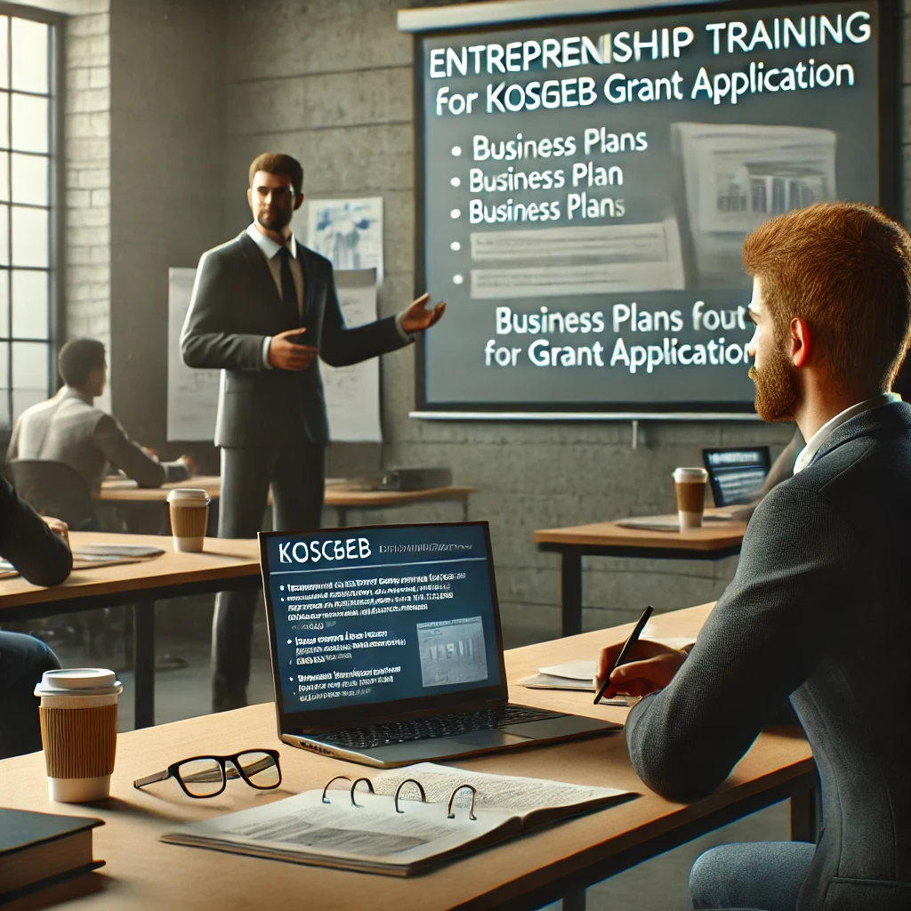
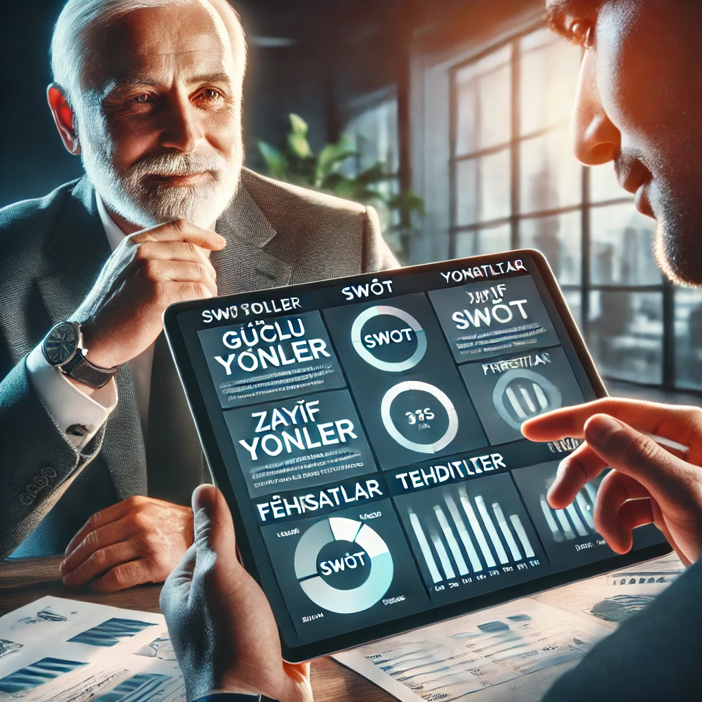

<!-- paginate: false -->

---

## Download Files

- [PDF PRESENTATION](girisimcilik-giris.marp.pdf)
- [PPTX PRESENTATION](girisimcilik-giris.marp.pptx)
- [PDF DOCUMENT](girisimcilik-giris.pandoc.pdf)
- [WORD DOCUMENT](girisimcilik-giris.pandoc.docx)

---

<!-- paginate: true -->

<!-- _backgroundColor: aquq -->

<!-- _color: black -->

# KOSGEB Support Programs from Idea to Market

### **What is a Project?** → **How to Get Support?** → **How to Start?** → **Develop, Grow, and Commercialize!**

**Learn the steps to grow your business with a project!**

 |  |  |  | 

#### **Dr. Uğur CORUH**

- **Coruh Arge ve Teknoloji, General Manager**
- **Recep Tayyip Erdoğan University, Department of Computer Engineering, Assistant Professor**

---

### **What is a Project and Why is it Important?**

A project is a planned effort to achieve a specific goal. Projects are undertaken to grow your business, offer new products, or increase efficiency.

  - Goal
  - Objective
  - Plan
  - Action
  - Result

---

### **Project Elements**

- **Project Purpose**  
  The general purpose of the project is to solve targeted problems or take advantage of opportunities.

- **Project Objectives**  
  The specific and measurable outcomes of the project.

- **Innovative Aspect of the Project**  
  What makes the project innovative and unique compared to others?

---

### **Project Elements**

- **Project Duration**  
  Information on the estimated start and end dates of the project.

- **Project Personnel**  
  The roles and expertise of the people contributing to the project.

- **Project Budget**  
  The cost of the project and its budget items.

---

### **Project Elements**

- **Methods and Implementation**  
  What methods and strategies will be used in the project?

- **Project Outputs**  
  What outputs and results will be achieved at the completion of the project?

---

### **What is the Purpose of Doing a Project?**

- Projects create new opportunities to grow your business.
- With KOSGEB support, you can finance your projects and help your business grow.

---

### **How Can I Develop My Business?**

- Analyze your current business, identify your needs,
- Think of solutions,
- Increase production,
- Offer new products,
- Use advertising to attract more customers.

---

### **What is KOSGEB?**

- KOSGEB is an organization that supports small and medium-sized enterprises.
- It is the most effective institution related to SMEs in Turkey.
- It aims to increase the export share of SMEs.
- It aims to increase the contribution of SMEs to employment.
- You can apply for projects to obtain the necessary funding to grow your business.

---

### **What Are the Benefits of KOSGEB Support for Businesses?**

- You receive financial support to realize your projects faster and with lower risk.
- This support can be used for:
  - buying new machinery,
  - expanding your business, or
  - marketing.

---

### **How to Apply for KOSGEB?**

- Register in the KOSGEB Database.
- If already registered, update your Declaration.
- Get information about the support program you will apply for.
- All applications are made electronically at wwww.kosgeb.gov.tr.

---

### **What is a Business Plan?**

A business plan explains:

- What your business will do in the future,
- How it will generate revenue, and
- What it needs to achieve its goals.

A business plan is required for KOSGEB support.

---

### **How to Prepare a Business Plan?**

- Write what your business will do,
- What products or services it will offer,
- Who it will target, and how
- You will execute the project.

---

### **Fill in the Business Plan (Project Information) Document**

- Defines the general framework of the support provided to entrepreneurs by KOSGEB.

---

### **Business Information**
- Company Name
- Tax Number
- Partners
- Organization chart, number of personnel, and their distribution
- Production site and facility information
- Production area
- Production location
- Projects submitted to other institutions and organizations and incentives and aids received

---

### **Business Machinery Inventory**
- Machinery/Equipment Name
- Quantity
- Domestic/Imported
- Features

---

### **Product Information Related to the Project**

- Introduction of the product subject to the project.

---

### **Foreign Trade Data Related to the Project Product**
- Last 3 Years
  - Import Amount (USD)
  - Export Amount (USD)
  - Foreign Trade Deficit (USD)

---

### **Domestic and Foreign Market Size of the Product**
- Last 3 Years
  - Domestic Market Size (Total Sales USD)
  - Foreign Market Size (Total Sales USD)
  - Domestic Demand Volume (Units)
  - Domestic Supply Volume (Units)
  - Foreign Demand Volume (Units)
  - Foreign Supply Volume (Units)
  - Sector Global Growth (%)

---

### **Export and Import Information Regarding Product or Equivalent**
- Last 3 Years
  - Product Import (USD)
  - Equivalent Import (USD)
  - Product Export (USD)
  - Equivalent Export (USD)

---

### **Competitors**
- Competitor Company Name
- Market Share (%)
- Strengths
- Weaknesses

---

### **Current and Potential Customers and Their Requests**
- Customer Information
- Estimated Customer Requests

---

### **Production-Sales Plan**

The production-sales plan is an important document that includes the production and sales targets of the business over a specific period. This plan includes:

- The costs of the products to be produced,
- Domestic and foreign sales prices,
- Estimated domestic and foreign sales quantities,
- Expected total sales revenues,
- Total costs,
- Expected profit.

This information plays a key role in determining the business's production capacity and marketing strategy.

---

### **Return on Investment Time**

Return on investment time shows how long it will take to recover the investment made. The factors affecting this time include:

- Expected profit,
- Depreciation expenses,
- Total cost and revenue,
- Discount rate and present value,
- Investment amount and payback period,
- Break-even point (the point where revenues equal investment costs).

---

### **Business History, Current Activities, Partners, and Project Experiences**
- Business history
- Products/product groups produced within the scope of current activities
- Project experiences and past experiences, education, and activities carried out by the business owner/partners
- The names and tax numbers of companies that the applicant company has partnered with outside of the application

---

### **Current Status Related to the Project**
- The business's current activities related to the project
- How needs are met under the current situation
- Other work

---

### **Purpose and Rationale of the Project**
- Why the project is needed
- Preparation and technical feasibility studies conducted as part of the project
- What is aimed at with the project

---

### **Project Topic**
- Activities to be carried out within the scope of the project
- How the project will affect:
  - Production/service delivery capacity
  - Product/service diversity
  - Technology level
  - Development of technical knowledge
  - Export potential
  - Human resource quality
- The solutions the project output addresses in the sector
- Applicability in other sectors

---

### **Project Goals and Activities**
- Project goals and activities should be explained with the target cards below.
- Under each goal:
  - The activities to be carried out to achieve the related goal,
  - The outputs of the activities should be listed in bullet points,
  - The project expenses related to each goal should be explained with justifications.
- The activity names written in this section should match the activity names in “3.1 Activity - Time Plan”.

---

### **Effect of the Project on Goals, Market, and Competition**
- Business's medium- and long-term goals
- How the project will contribute to achieving these goals
- The project's:
  - Effect on the business's market share
  - Impact on market expansion
  - Appropriateness of the project location in terms of logistics

---

### **Risks, Measures, and Assumptions**
- Possible risks during and after the project implementation
- Measures to be taken for these
- Assumptions that may have a positive impact on the project implementation process

---

### **Business Resources to Be Used in the Project**
- To be used in the project:
  - Personnel owned by the business
  - Machinery-like resources
  - Expenses to be incurred with their own means during the project process
  - Their contribution to the project

---

### **Project Management**
- Communication and coordination between the Project Manager, business managers, and relevant departments:
  - How communication and coordination will be ensured regarding the project
  - Review systematics related to project progress
  - Task distribution related to KOSGEB project monitoring processes
- In the event of a change of Project Manager, the structure should be established in such a way that there will be no disruption in project management.

---

### **Sustainability**
- How the sustainability of the expected results of the project will be ensured after the project is completed
- Explanation of sustainability both institutionally and financially

---

### **Business Model Canvas**

---

### **Evaluate Your Business with SWOT Analysis**

- What are the strengths and weaknesses of your business?
- Customer satisfaction may be high, but your digital infrastructure may be lacking.

Analyze the strengths and weaknesses of your business with SWOT and create your business plan in a strategic framework with the Business Model Canvas.

---

#### **SWOT Table**

- **Strengths**: High-quality products, customer loyalty.
- **Weaknesses**: Lack of digital infrastructure, insufficient marketing.
- **Opportunities**: Transition to online sales, new customer base.
- **Threats**: Increasing number of competitors, changing market dynamics.

---

<!-- _color: black -->

## Thank You!

#### Question and Answer Section

- Feel free to ask questions about the projects.
- For more information: [kosgeb.gov.tr](https://www.kosgeb.gov.tr)
- Check the Frequently Asked Questions page
  - https://www.kosgeb.gov.tr/Web/Genel/SSS.aspx?KatID=2
- You can get consulting and support from chambers of commerce.

---

<!-- paginate: false -->

<!-- _backgroundColor: aquq -->

<!-- _color: black -->

# KOSGEB Support Programs from Idea to Market

 |  |  |  | 

#### **Dr. Uğur CORUH**
- **Coruh Arge ve Teknoloji, General Manager**
- (ugur.coruh[*]coruh.com.tr)
- **Recep Tayyip Erdoğan University, Department of Computer Engineering, Assistant Professor**
- (ugur.coruh[*]erdogan.edu.tr)

---

<!-- paginate: false -->

